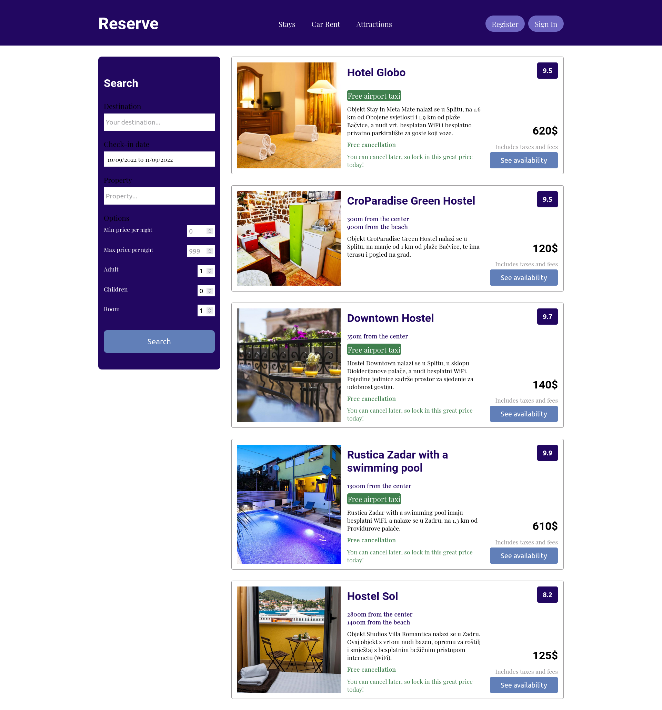
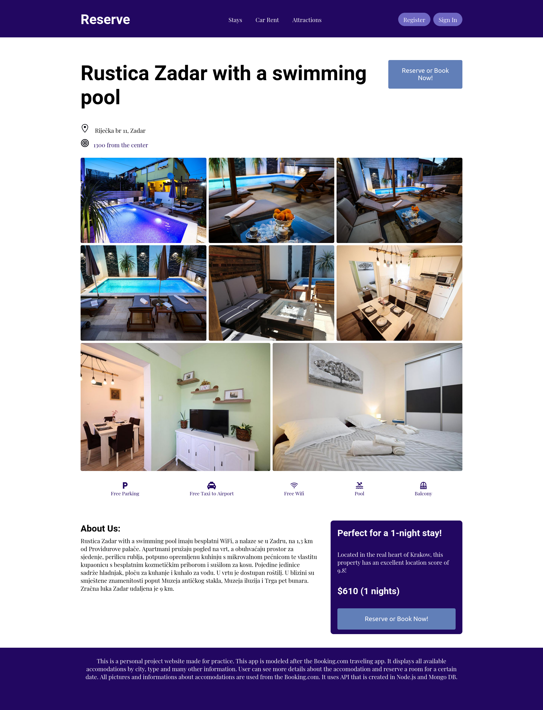

# Reservation App

## Technology used:

- React JS
- HTML/CSS
- Google Fonts
- React Icons
- React Router
- API created with Node.js, Express.js and Mongo DB

## Live

[https://reservation-app-psi.vercel.app/]

---

## Users should be able to:

- Search for an accommodation using an `input` field or by clicking on pictures that representes cities or properies
- See 4 featured accommodations
- Search by city, date, options(adults, children, rooms), type of property, min price and my price
- Click on an accommodation to see more detailed information on a separate page
- Click on the picture to open the slider
- Click on the button to reserve a place, where user needs to be logged in
- Log in
- Register

## Screenshot

---

### Home Page

## 

---

### Hotels

## 

---

### Hotel

## 

## To do

- User should be able to reserve a room for a date and that room should be unavailable for that date
  -admin page
